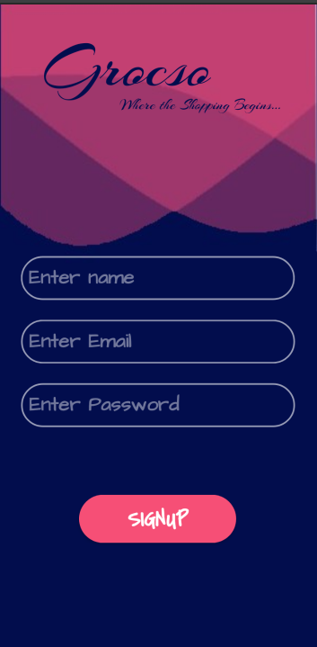
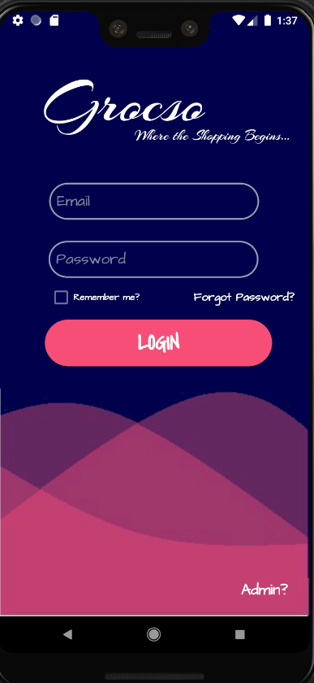
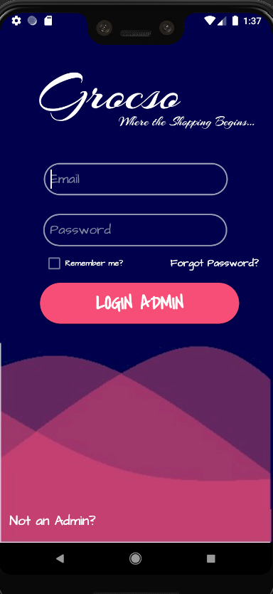
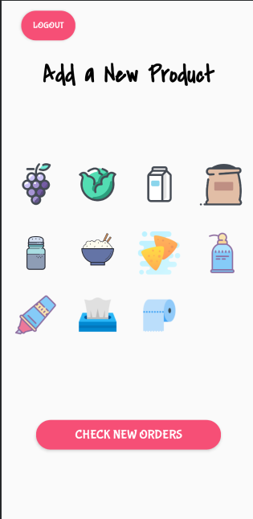
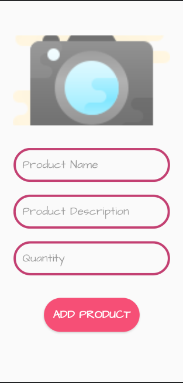

The Grocery App: 

The Grocery App, was developed as an initiative to reduce the time taken to make tons of shopping list and the forgetting them before going for purchasing or losing the list. This app uses Firebase to store and has a Individual User access that allows his or her own version of the grocery app. The following images will explain in detail how this application functions'.

 
A User-Login / Sign up page to enable users to add themselves to the database. The admin login allows the admin with priviledged access to the admin, allowing only the admin to Add and Customize Product details.

 
 

 
This allows the users to enter the details and allows them to log themselves and give them their own special access to have their own customized lists made, to make their shopping a bit more fun!

 
 

 
A standard User login page, developed solely for the purpose of users getting logged in.

 
 

 
An Admin page designed and programming to give priviledged access to admins to access and make changes to the product and their details.

 
 

 
Page designed to add products to various product choices as preferred by the user.

 
 

 
This page allows the admin to add an image of the product, the product name, and a neat description of the product, if needed.

