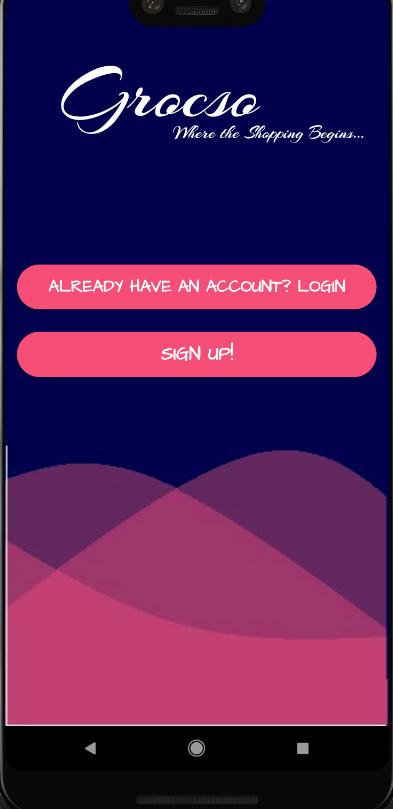

The Grocery App

The Grocery App, was developed as an initiative to reduce the time taken to make tons of shopping list and the forgetting them before going for purchasing or losing the list. This app uses Firebase to store and has a Individual User access that allows his or her own version of the grocery app. The following images will explain in detail how this application functions'.

